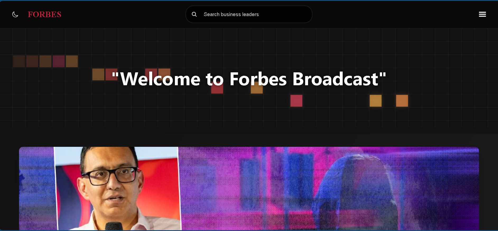

 # Forbes-Inspired React News Portal

This is one of my first web application projects.

A premium, Forbes-inspired news web application built with React, featuring a live news feed API integration, smooth Framer Motion animations, and an interactive HTML5 Canvas background.

 

##  Preview

---

##  Features

* **Dynamic News Feed:** Integrates with a live news API to fetch real-time business, technology, and leadership articles structured into a clean, 3-column editorial grid.
* **Interactive Canvas Background:** Built a custom `GridCursorBackground` using the native HTML5 2D Context Canvas API to track mouse positions dynamically with seamless resizing support.
* **Glassmorphism Navigation Drawer:** A production-grade sliding sidebar navigation menu utilizing `framer-motion`'s `AnimatePresence` and backdrop-blur filters for a fluid user experience.
* **Premium Dark Theme:** Designed with a high-end, editorial low-light aesthetic featuring sharp typography, clear layouts, and iconic crimson accents mimicking the Forbes design language.
* **Responsive Layout:** Adaptive styling optimized across different device breakpoints, managing clean layout scaling for both desktop and mobile views.

---

##  Tech Stack

* **Core Frontend:** React.js (Functional components & Hooks: `useState`, `useEffect`, `useRef`)
* **Animations:** Framer Motion (Hardware-accelerated interface transitions)
* **Graphics Loop:** HTML5 Canvas API (Custom animation frames for background effects)
* **Iconography:** React Icons (`react-icons/ios5` and `react-icons/gi`)
* **Styles:** Scalable, component-scoped CSS architecture

---